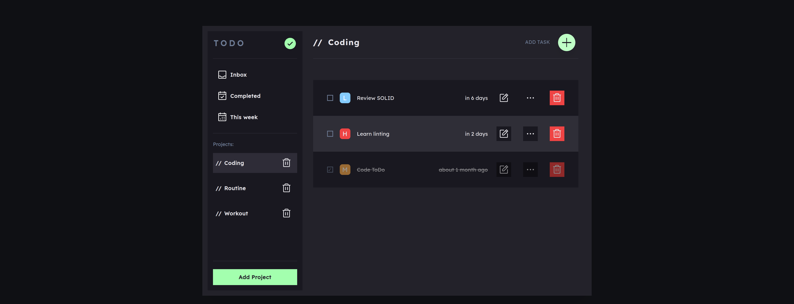
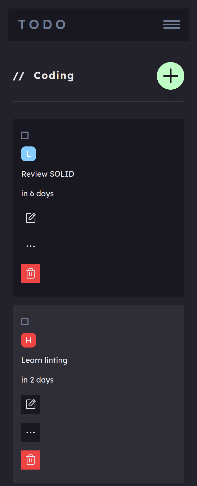

# TODO-List
TODO List is a task management system where you can store your tasks that you manage in different project and different categories.

## Table of concepts
- [Overview](#overview)
  - [Screenshot](#screenshot)
  - [Links](#links)
- [Built with](#built-with)
- [Author](#author)

## Overview

### Screenshots

### Links
  - Live preview - [ToDo List](https://emrahiso.github.io/Todo-List/)
  - GitHub repo - [ToDO List Repo](https://github.com/EmrahIso/Todo-List.git)

## Built with 
  - HTML
  - CSS
  - SCSS
  - JS
  - WEBPACK
  
## Author

- GitHub - [@EmrahIso](https://github.com/EmrahIso)